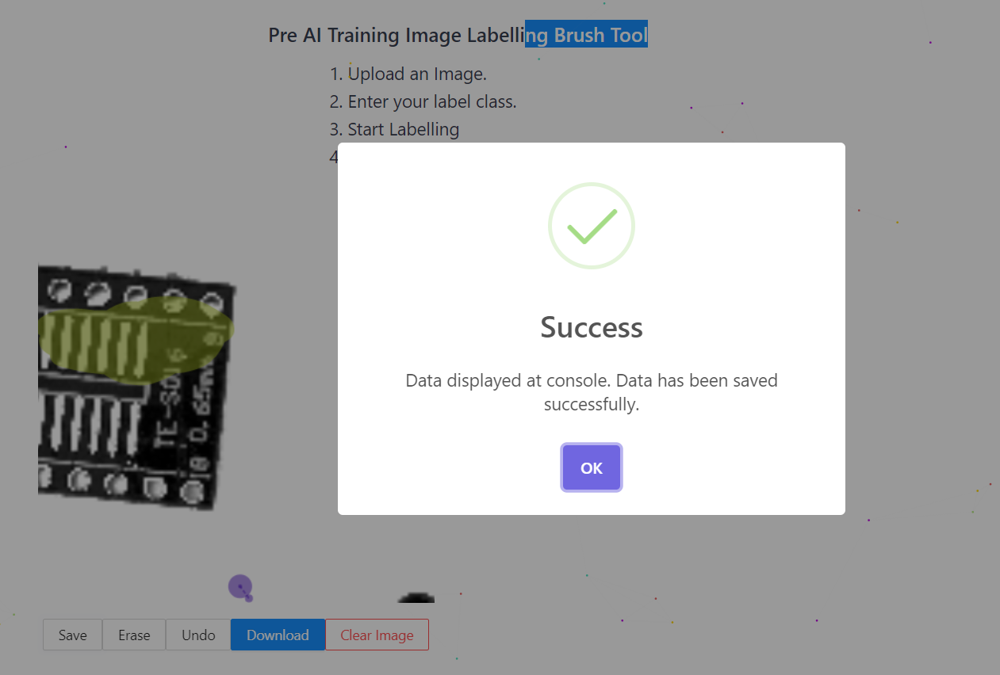

## AI Image Labelling - Brush Tool

### DEMO

- Check out our demo application of using AI image labelling bursh.
  - [AI Labelling Brush Tool](andrewtclin.pythonanywhere.com/)

### Overview

- The AI Image Brush Tool is a powerful tool built using Python and React that enables users to **upload, label, and download annotated images with coordinates**.
- This tool simplifies the process of image labelling by providing an intuitive interface and efficient data processing.
- With the ability to **specify label classes, label images, and download the labelled data** in a desired format, the AI Image Brush Tool streamlines image annotation tasks.

### Features

1. Upload images for labelling.
2. Specify label classes on the right panel.
3. Select a label and start labelling images.
4. Download labelled data in a specified format.
